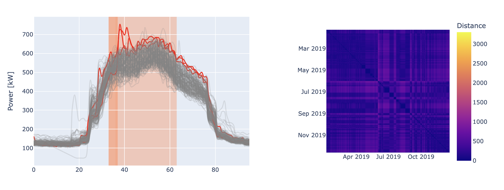

# Matrix Profile Paper

The Matrix Profile has the potential to revolutionize time series data mining because of its generality, versatility,
simplicity and scalability. In particular it has implications for time series motif discovery, time series joins,
shapelet discovery (classification), density estimation, semantic segmentation, visualization, rule discovery,
clustering etc.




## Project Organization

- `src`: Folder containing the contextual matrix profile codebase (i.e., folder `cmp`) and necessary packages (i.e., `distancematrix`).
- `tests`: Contains Python-based test cases to validate source code.
- `pyproject.toml`: Contains metadata about the project and configurations for additional tools used to format, lint,
  type-check, and analyze Python code. (
  See [here](https://packaging.python.org/en/latest/guides/writing-pyproject-toml/) for reference)

## Getting started

Create virtual environment and activate it and install dependencies:

- Makefile
  ```bash
  make setup
  ```
- Linux:
  ```bash
  python3 -m venv .venv
  source .venv/bin/activate
  pip install -r requirements.txt
  ```
- Windows:
  ```bash
  python -m venv venv
  venv\Scripts\activate
  pip install -r requirements.txt
  ```

Run the main script through the console:
```bash
source .venv/bin/activate
python -m src.cmp.main
```

You should see in the terminal a message output like the following:

```txt
CONTEXT 1 : Subsequences of 05:45 h (m = 23) that start in [00:00,01:00) (ctx_from00_00_to01_00_m05_45)
99.997%        0.0 sec

- Cluster 1 (1.181 s)   -> 1 anomalies
- Cluster 2 (0.508 s)   -> 3 anomalies
- Cluster 3 (0.473 s)   -> 4 anomalies
- Cluster 4 (0.658 s)   -> 5 anomalies
- Cluster 5 (-)         -> no anomalies green
```

At the end of the execution you can find the results in the [`results`](src/cmp/results) folder.


## Run using docker

Build the docker image.
- Makefile
  ```bash
  make docker-build
  ```
- Linux:
  ```bash
  docker build -t cmp .
  ```

Run the docker image.
- Makefile
  ```bash
  make docker-run
  ```
- Linux:
  ```bash
  docker run cmp
  ```

At the end of the execution you can find the results in the [`results`](src/cmp/results) folder.

### Context definition

```
# 2) User Defined Context
# We want to find all the subsequences that start from 00:00 to 02:00 (2 hours) and covers the whole day
# In order to avoid overlapping we define the window length as the whole day of
# observation minus the context length.

# - Beginning of the context 00:00 AM [hours]
context_start = 17

# - End of the context 02:00 AM [hours]
context_end = 19

# - Context time window length 2 [hours]
m_context = context_end - context_start  # 2

# - Time window length [observations]
# m = 96 [observations] - 4 [observation/hour] * 2 [hours] = 88 [observations] = 22 [hours]
# m = obs_per_day - obs_per_hour * m_context
m = 20  # with guess

# Context Definition:
# example FROM 00:00 to 02:00
# - m_context = 2 [hours]
# - obs_per_hour = 4 [observations/hour]
# - context_start = 0 [hours]
# - context_end = context_start + m_context = 0 [hours] + 2 [hours] = 2 [hours]
contexts = GeneralStaticManager([
    range(
        # FROM  [observations]  = x * 96 [observations] + 0 [hour] * 4 [observation/hour]
        (x * obs_per_day) + context_start * obs_per_hour,
        # TO    [observations]  = x * 96 [observations] + (0 [hour] + 2 [hour]) * 4 [observation/hour]
        (x * obs_per_day) + (context_start + m_context) * obs_per_hour)
    for x in range(len(data) // obs_per_day)
])
```

## Cite

You can cite this work by using the following reference or either though [this Bibtex file](./docs/ref.bib).

> Chiosa, Roberto, et al. "Towards a self-tuned data analytics-based process for an automatic context-aware detection and
diagnosis of anomalies in building energy consumption timeseries." Energy and Buildings 270 (2022): 112302.

## Contributors

- [Roberto Chiosa](https://github.com/RobertoChiosa)

## License

This code is licensed under the MIT License - see the [LICENSE](LICENSE.md) file for details.
